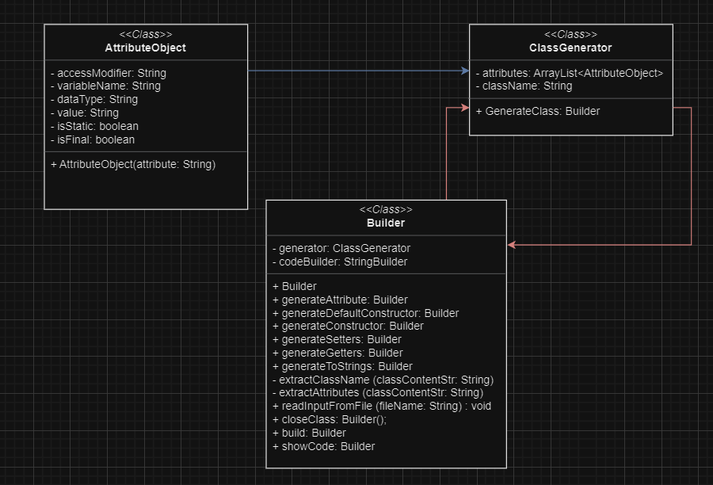
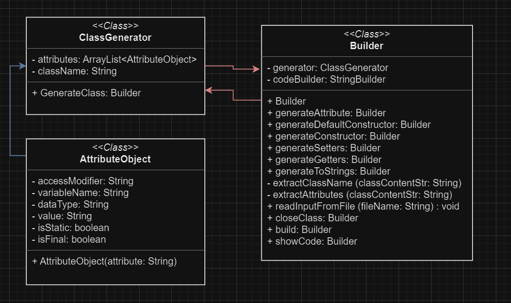
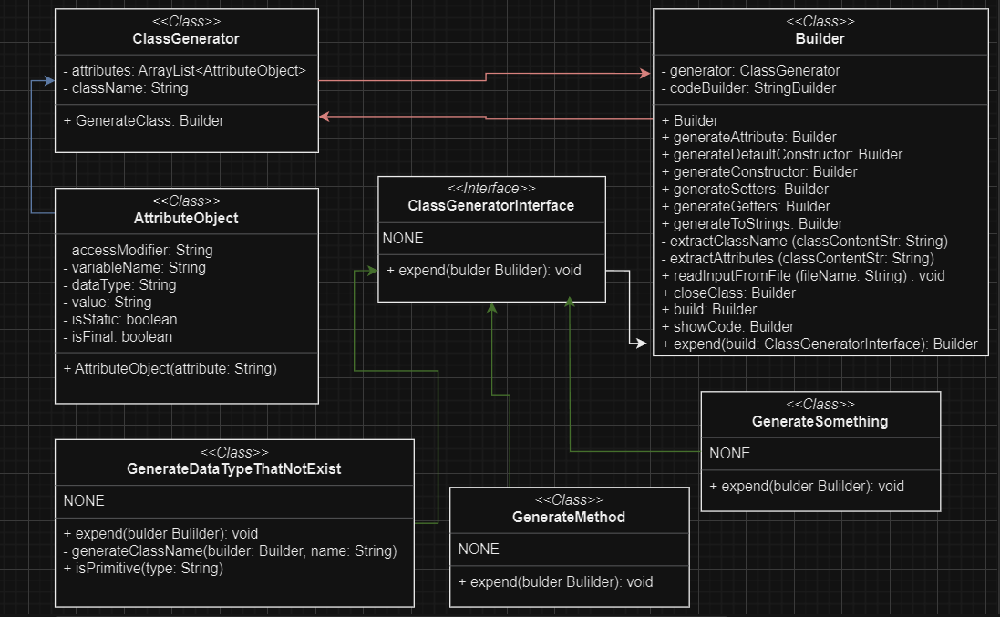

## Generimi i klases ne base te atributeve te saj

**Detyra**: Nga nje klas me attribute te Generohet Setters, Getters, Constructor dhe toString.

**Input:**

``` java
public class Student {
    public String emri = "Albana";
    public String mbiemri;
    public int nota = 4;
    private String ditelindja;
    String adresa;
    boolean isMarried;
    public static int nrStudenteve;
}
```

**Output:**

``` java
public class Student {
    public static int nrStudenteve;
    public String emri = "Albana";
    public String mbiemri;
    public int nota = 4;
    public String adresa;
    public boolean isMarried;
    private String ditelindja;

    public Studentdadadasdads(String emri, String mbiemri, int nota, String ditelindja, String adresa, boolean isMarried, int nrStudenteven) {
        this.emri = emri;
        this.mbiemri = mbiemri;
        this.nota = nota;
        this.ditelindja = ditelindja;
        this.adresa = adresa;
        this.isMarried = isMarried;
        nrStudenteve = nrStudenteven;
    }

    public Studentdadadasdads() {
        this.emri = "";
        this.mbiemri = "";
        this.nota = 0;
        this.ditelindja = "";
        this.adresa = "";
        this.isMarried = false;
        nrStudenteve = 0;
    }

    public String getEmri() {
        return this.emri;
    }

    public void setEmri(String emri) {
        this.emri = emri;
    }

    public String getMbiemri() {
        return this.mbiemri;
    }

    public void setMbiemri(String mbiemri) {
        this.mbiemri = mbiemri;
    }

    public int getNota() {
        return this.nota;
    }

    public void setNota(int nota) {
        this.nota = nota;
    }

    public String getDitelindja() {
        return this.ditelindja;
    }

    public void setDitelindja(String ditelindja) {
        this.ditelindja = ditelindja;
    }

    public String getAdresa() {
        return this.adresa;
    }

    public void setAdresa(String adresa) {
        this.adresa = adresa;
    }

    public boolean getIsMarried() {
        return this.isMarried;
    }

    public void setIsMarried(boolean isMarried) {
        this.isMarried = isMarried;
    }

    public int getNrStudenteve() {
        return nrStudenteve;
    }

    public void setNrStudenteve(int nrStudenteven) {
        nrStudenteve = nrStudenteven;
    }


    public String toString() {
        return
                "emri: " + this.emri +
                "mbiemri: " + this.mbiemri +
                "nota: " + this.nota +
                "ditelindja: " + this.ditelindja +
                "adresa: " + this.adresa +
                "isMarried: " + this.isMarried +
                "nrStudenteve: " + nrStudenteve;
    }
}
```

**Funksionalitet qe duhet te kemi:**

- Të gjenerojm emrin e klases


- Të gjenerojm atributet e klases
    - Access Modifier
        - nëse klasa ka access modifier ather është _public_
    - Data Type
        - Mund te jete primitive ose referencë (ArrayList, Student)
    - Emri i Atributit
    - Vlera e Atributit
    - Attributet statike
    - Atributet finale


- Te gjenerojm konstruktorin e klases
    - Të gjenerojm konstruktorin me parametra
    - Të gjenerojm konstruktorin pa parametra
        - Nese kemi atributet finale, atehere konstruktori pa parametra nuk gjenerohet
        - Nese kemi atributet statike, duhet te kthejm ne mënyr statike
        - Vlera default te kthehet ne baze te data type te atributit
        - Ne te dy konstruktorët, atributet statike duhet te kthehen ne mënyr statike


- Te gjenerojm getters dhe setters
    - Data Type
    - Atributet statike


- Te gjenerojm toString
    - Të gjenerojm toString me atributet dhe vlerat e tyre

**Përshkrimi:**

Per kete detyr mund punojm me **Builder Pattern**

**Builder Pattern** - është e dizajnuare për të ofruar zgjithje fleksibile për problemet e ndryshme të krijimit të
objeckteve në OOP.

Qëllimi është të ndajë ndërtimin e një objekti kompleks nga përfaqësimi i tij




.. qyto kom e me shkru pak per klasesn qysh e kom bo

Perdorimi
```java
 public static void main(String[] args) {
        String input = "src/Detyra_2/input.txt";
        
        GenerateClass()
                .readFile(input)
                .generate()
                .constructors()
                .getters()
                .setters()
                .toStrings()
                .build();
//                .showCode();
    }
```


Por cka nese deshirojm te zgjerojm klassen pa pasur nevoj per te ndryshuar kodin ekzistues?

Pershembull:

Gjeneroj classat për Data Type qe nuk egzistojnë, **public Address address** mirepo pa e prekur klasen **Bulder**

Atehere ne kete rast perdorim **Open/Closed Principle**

**Open/Closed Principle** - Një klas duhet të jetë hapur për zgjerim, por e mbyllur për modifikim.



**Përshkrimi:**

Pra ne mund te shtojm sa functiona te deshirojm pa ndryshuar kodin ekzistues.

```java
public class GenerateDataTypeThatNotExist implements ClassBuilderInterface {
    public void extend(Builder builder) {...}
}
```

```java
public class GenerateMethod implements ClassBuilderInterface {
    public void extend(Builder builder) {...}
}
```

The mund ti thirrim kto funksione ne kete menyre:

```java
public static void main(String[]args){
        String input="src/Detyra_2/input.txt";

        ClassBuilder.GenerateClass()
        .readFile(input)
        .generate()
        .extend(new GenerateDataTypeThatNotExist())
        .extend(new GenerateMethod())
        .extend(new GenerateToString())
        .build();
        }
```


